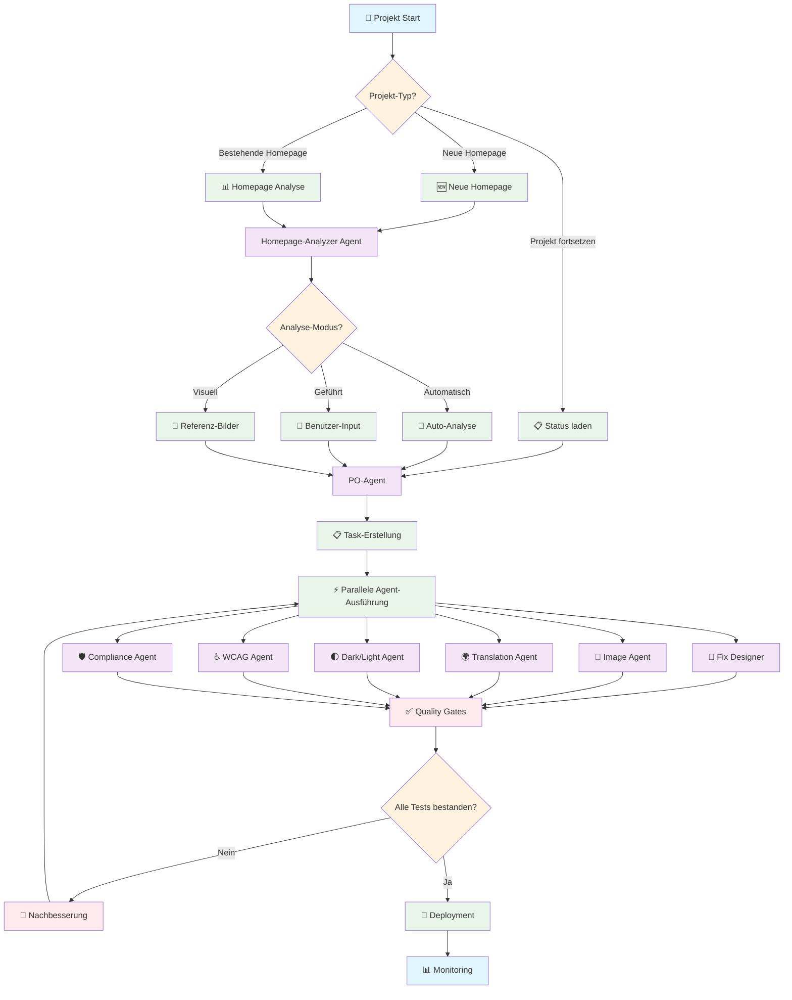
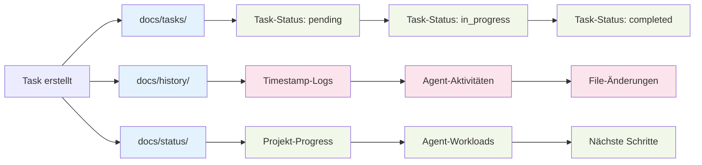

# 🎨 UX Landing Page Generator

> **AI-powered landing page generator with modular components, professional templates, automated content generation, and conversion optimization using React, Tailwind CSS, and Framer Motion.**

Complete system with 6 professional template styles, intelligent content generation, responsive design, and advanced animations.

[](https://www.npmjs.com/package/@appiq-solutions/ux-landing-page-generator)
[](LICENSE)
[](https://github.com/appiq-solutions/ux-landing-page-generator/actions)

## 🎯 Überblick

Dieses professionelle Workflow-System bietet AI-gesteuerte Agenten für die moderne Webentwicklung mit Fokus auf:

- **React + TypeScript** - Moderne Frontend-Entwicklung
- **Tailwind CSS + shadcn/ui** - Utility-first CSS Framework mit Komponenten
- **Framer Motion** - Hochwertige Animationen und Micro-Interactions
- **WCAG 2.1/2.2 Compliance** - Vollständige Barrierefreiheit
- **GDPR/DSGVO Konformität** - Datenschutz und Rechtskonformität
- **Performance Optimization** - Core Web Vitals und Lighthouse-Scores
- **Automated Deployment** - CI/CD mit GitHub Actions und Vercel

## 🔄 Workflow Visualisierung



## 📊 State-Management & Tracking System



## 🤖 AI-Agenten System

### **Fix Designer Agent** 🎨
Erstellt moderne, responsive Webdesigns mit aktuellsten Designtrends.

**Spezialisierungen:**
- React Component Design mit TypeScript
- Tailwind CSS + shadcn/ui Integration
- Framer Motion Animationen
- Dark Mode und Glassmorphism
- Responsive Design (Mobile-First)

**Beispiel-Einsatz:**
```bash
appiq-web-workflow --agent fix-designer --task "Create hero section with glassmorphism"
```

### **Homepage-Analyzer Agent** 🔍
Analysiert bestehende Websites und generiert Optimierungsvorschläge.

**Funktionen:**
- URL-basierte Website-Analyse
- UX/UI Verbesserungsvorschläge
- Performance-Audit (Core Web Vitals)
- Accessibility-Assessment (WCAG)
- SEO-Optimierung Empfehlungen

**Beispiel-Einsatz:**
```bash
appiq-web-workflow --agent homepage-analyzer --url "https://example.com"
```

### **Image Agent** 📸
Umfassende Bildverwaltung und -optimierung für Web-Performance.

**Features:**
- Automatische Bildkomprimierung
- Format-Konvertierung (WebP, AVIF)
- Responsive Image Delivery
- Lazy Loading Implementation
- CDN Integration

**Beispiel-Einsatz:**
```bash
appiq-web-workflow --agent image --task "Optimize product gallery images"
```

### **Compliance Checker Agent** 🛡️
Stellt sicher, dass Websites allen Accessibility- und Rechtsstandards entsprechen.

**Validierungen:**
- WCAG 2.1 AA/AAA Compliance
- WCAG 2.2 Enhancements
- GDPR/DSGVO Konformität
- Keyboard Navigation Testing
- Screen Reader Optimization
- Color Contrast Validation

**Beispiel-Einsatz:**
```bash
appiq-web-workflow --agent compliance-checker --audit "full-accessibility"
```

## 🚀 Quick Start

### Installation

```bash
# Via npm
npm install -g @appiq-solutions/web-development-workflow

# Via yarn
yarn global add @appiq-solutions/web-development-workflow

# Via pnpm
pnpm add -g @appiq-solutions/web-development-workflow
```

### Neues Projekt erstellen

```bash
# Neues React + Tailwind Projekt
appiq-web-workflow create my-awesome-website

# Mit spezifischem Template
appiq-web-workflow create my-website --template "saas-landing"

# Interaktiver Modus
appiq-web-workflow create --interactive
```

### Agenten verwenden

```bash
# Fix Designer für Homepage-Design
appiq-web-workflow --agent fix-designer --task "Create modern SaaS landing page"

# Website analysieren
appiq-web-workflow --agent homepage-analyzer --url "https://competitor.com"

# Bilder optimieren
appiq-web-workflow --agent image --optimize "./src/assets/images"

# Compliance prüfen
appiq-web-workflow --agent compliance-checker --check-wcag
```

## 🏗️ Projekt-Struktur

```
modern-web-project/
├── src/
│   ├── components/
│   │   ├── ui/              # shadcn/ui Komponenten
│   │   ├── layout/          # Layout-Komponenten
│   │   ├── sections/        # Seitenabschnitte
│   │   └── accessibility/   # Accessibility-Komponenten
│   ├── hooks/               # Custom React Hooks
│   ├── utils/               # Utility-Funktionen
│   ├── styles/              # CSS/Tailwind Konfiguration
│   └── assets/              # Bilder, Icons, Fonts
├── docs/                    # Dokumentation
├── .github/workflows/       # CI/CD Pipelines
└── config/                  # Agent-Konfigurationen
```

## 🎨 Design-Referenzen

Das System orientiert sich an modernen Design-Trends inspiriert von:

- **Cadence AI** - Dark Mode, Minimalismus, electric blue Akzente
- **Viper Template** - Bold Typography, High-Contrast Design
- **Pepper** - Playful Farben, mehrere Font-Kombinationen
- **Portfolite** - Professional Layout, Clean Aesthetics
- **Sonic** - Animated Interactions, Dynamic Content

## 🔧 Technologie-Stack

### **Frontend Framework**
- **React 18** mit TypeScript
- **Vite** als Build-Tool
- **ESLint + Prettier** für Code-Qualität

### **Styling & Design**
- **Tailwind CSS** mit Custom Configuration
- **shadcn/ui** für Basis-Komponenten
- **Framer Motion** für Animationen
- **Lucide React** für Icons

### **Accessibility & Compliance**
- **@axe-core/react** für Accessibility-Testing
- **Pa11y-CI** für automatisierte WCAG-Tests
- **eslint-plugin-jsx-a11y** für A11y Linting

### **Performance & SEO**
- **Lighthouse CI** für Performance-Monitoring
- **Vite Bundle Analyzer** für Bundle-Optimierung
- **ImageMin** für Bildkomprimierung

### **Testing & Quality**
- **Vitest** für Unit Tests
- **Testing Library** für Component Tests
- **Playwright** für E2E Tests

## 📊 Quality Gates

Jedes Deployment durchläuft automatische Quality Gates:

### **Code Quality**
- ✅ TypeScript Compilation ohne Errors
- ✅ ESLint Rules (0 Warnings Policy)
- ✅ Prettier Code Formatting
- ✅ Unit Test Coverage >90%

### **Performance**
- ✅ Lighthouse Performance Score >90
- ✅ Core Web Vitals bestanden
- ✅ Bundle Size unter 200KB (gzipped)
- ✅ Image Optimization validiert

### **Accessibility**
- ✅ WCAG 2.1 AA Compliance
- ✅ Axe-core Tests bestanden
- ✅ Keyboard Navigation validiert
- ✅ Screen Reader Testing

### **Legal Compliance**
- ✅ GDPR/DSGVO Konformität
- ✅ Cookie Consent implementiert
- ✅ Privacy Policy aktualisiert
- ✅ Accessibility Statement vorhanden

## 🚀 Deployment Pipeline

### **Automatische Deployments**

```yaml
# GitHub Actions Workflow
Staging: develop branch → staging.vercel.app
Production: main branch → production.vercel.app
```

### **Quality Checks vor Deployment**

1. **Code Quality Pipeline**
   - Type checking, linting, unit tests
   - Build verification

2. **Accessibility Pipeline**
   - WCAG compliance validation
   - Lighthouse accessibility audit
   - axe-core testing

3. **Performance Pipeline**
   - Core Web Vitals measurement
   - Bundle size analysis
   - Image optimization check

4. **Security Pipeline**
   - Dependency vulnerability scan
   - OWASP security check
   - Code security analysis

## 📚 Dokumentation

### **Setup-Guides**
- [Web Deployment Guide](docs/web-deployment-guide.md)
- [Agent-Konfiguration](docs/agent-configuration.md)
- [Accessibility Guidelines](docs/accessibility-guide.md)
- [Performance Optimization](docs/performance-guide.md)

### **Best Practices**
- [React Development](docs/react-best-practices.md)
- [Tailwind CSS Usage](docs/tailwind-best-practices.md)
- [Accessibility Implementation](docs/accessibility-implementation.md)
- [Performance Optimization](docs/performance-optimization.md)

## 🤝 Beitragen

Wir freuen uns über Beiträge! Siehe [CONTRIBUTING.md](CONTRIBUTING.md) für Details.

### **Development Setup**

```bash
# Repository klonen
git clone https://github.com/appiq-solutions/web-development-workflow.git
cd web-development-workflow

# Dependencies installieren
npm install

# Development starten
npm run dev

# Tests ausführen
npm test
```

## 📄 Lizenz

MIT License - siehe [LICENSE](LICENSE) für Details.

## 🏢 Support

- **GitHub Issues**: [Bug Reports & Feature Requests](https://github.com/appiq-solutions/web-development-workflow/issues)
- **Email**: info@appiq-solutions.com
- **Website**: [https://appiq-solutions.com](https://appiq-solutions.com)

---

**Erstellt mit ❤️ von [Appiq Solutions](https://appiq-solutions.com)**

*Professional AI-powered development workflows für moderne Web-Technologien*